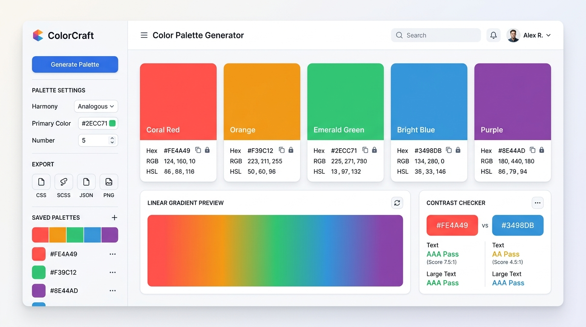

<div align="center">

# 🎨 ColorCraft — Color Palette Generator & Design System Studio

<p align="center">
  <strong>A modern, zero-dependency, WCAG-compliant color palette generator and design system workspace.</strong>
  <br />
  Craft harmonious color schemes, inspect contrast ratios, build CSS gradients, and test palettes on real-time UI components.
</p>

<p align="center">
  <a href="#-quick-start"></a>
  <a href="LICENSE"></a>
  <a href="#-accessibility--wcag-compliance"></a>
  <a href="#-tech-stack"></a>
  <a href="#-tech-stack"></a>
</p>

<p align="center">
  <a href="#-features">Features</a> •
  <a href="#-keyboard-shortcuts">Shortcuts</a> •
  <a href="#-quick-start">Quick Start</a> •
  <a href="#-deployment-to-github-pages">Deploy to GitHub Pages</a> •
  <a href="#-accessibility--wcag-compliance">Accessibility</a> •
  <a href="#-contributing">Contributing</a> •
  <a href="#-license">License</a>
</p>

<br />

[](assets/images/preview.png)

</div>

---

## 📖 Table of Contents

- [Overview](#-overview)
- [Key Features](#-key-features)
  - [1. Palette Generator & Harmony Engine](#1-palette-generator--harmony-engine)
  - [2. Multi-Format Conversions & Toast Notifications](#2-multi-format-conversions--toast-notifications)
  - [3. Interactive CSS Gradient Generator](#3-interactive-css-gradient-generator)
  - [4. Real-Time WCAG 2.1 Contrast Checker](#4-real-time-wcag-21-contrast-checker)
  - [5. Live Interactive Website Mockup](#5-live-interactive-website-mockup)
  - [6. Favorites Library & LocalStorage](#6-favorites-library--localstorage)
  - [7. Design System Export Studio](#7-design-system-export-studio)
- [Keyboard Shortcuts](#-keyboard-shortcuts)
- [Tech Stack](#-tech-stack)
- [Repository Structure](#-repository-structure)
- [Quick Start](#-quick-start)
- [Deployment to GitHub Pages](#-deployment-to-github-pages)
- [Accessibility & WCAG Compliance](#-accessibility--wcag-compliance)
- [Roadmap & Future Enhancements](#-roadmap--future-enhancements)
- [Contributing](#-contributing)
- [License](#-license)

---

## 🌟 Overview

**ColorCraft** is an open-source, client-side web application tailored for frontend engineers, UI/UX designers, and design system creators. Built entirely with vanilla technologies and modern Bootstrap 5 components, it requires **no backend, no database, no bundlers, and zero build configuration**.

Double-click `index.html` or host it with any static web server to start creating production-ready color palettes immediately.

---

## ✨ Key Features

### 1. Palette Generator & Harmony Engine
* **5 Distinct Color Swatches**: Generates five balanced, aesthetically rich colors simultaneously using golden-ratio hue distribution.
* **Six Algorithmic Color Harmonies**:
  * 🎲 **Curated Vibrant**: Golden-ratio distributed hues preventing muddy tones.
  * 🌈 **Analogous**: Adjacent color-wheel hues within a $20^\circ - 25^\circ$ spread.
  * 🌓 **Monochromatic**: Nuanced step variations across luminance and saturation.
  * 🔺 **Triadic**: High-contrast, balanced triad at $120^\circ$ increments.
  * ⚡ **Complementary**: High-impact opposing pairs ($180^\circ$ offset).
  * 🌿 **Split-Complementary**: Base hue complemented by two adjacent opposing accents ($150^\circ$ and $210^\circ$).
* **Swatch Locking**: Lock individual colors so their values persist across re-generations.
* **Spacebar Regeneration**: Hit <kbd>Space</kbd> anywhere to quickly cycle palettes (automatically disabled when typing in inputs, sliders, or modal dialogs).
* **Reset Baseline**: Quickly restore a clean, calibrated default baseline set.
* **Native Eyedropper / Color Picker**: Direct color inputs embedded in every swatch for precision fine-tuning.

### 2. Multi-Format Conversions & Toast Notifications
* **Simultaneous Conversion**: Calculates valid **HEX**, **RGB**, and **HSL** values for all swatches in real time.
* **Format Switcher**: Toggle the primary displayed color format globally between HEX, RGB, and HSL.
* **Click-to-Copy with Dual Fallbacks**: Click any swatch or copy icon to copy color values to the clipboard. Seamlessly falls back to an in-memory textarea copy mechanism if `navigator.clipboard` is restricted in unsecure contexts.
* **Bootstrap 5 Interactive Toasts**: Non-blocking toast notifications appear with instant visual confirmation upon every clipboard copy.

### 3. Interactive CSS Gradient Generator
* **Palette Sync**: Select any two colors directly from your generated palette swatches.
* **360° Angle Slider & Quick Presets**: Adjust gradient angles with smooth slider feedback or tap preset pills (`0° Top`, `45°`, `90° Right`, `135° Diagonal`, `180° Bottom`, `270° Left`).
* **Live Visual Canvas**: Real-time rendering container showcasing the gradient fill.
* **Production-Ready CSS Output**: Formats valid CSS code snippets (e.g. `background: linear-gradient(135deg, #2563EB, #60A5FA);`) with a single-click copy button.

### 4. Real-Time WCAG 2.1 Contrast Checker
* **W3C Relative Luminance Formula**: Implements the official WCAG 2.1 specification:
  $$L = 0.2126 \times R_{\text{lin}} + 0.7152 \times G_{\text{lin}} + 0.0722 \times B_{\text{lin}}$$
* **Contrast Ratio Meter**: Accurately computes $(L_1 + 0.05) / (L_2 + 0.05)$ and displays the resulting ratio (e.g., `7.42:1`).
* **WCAG Compliance Status Badges**:
  * 🟢 **AA Normal Text**: Requires $\ge 4.5:1$ ratio.
  * 🟢 **AA Large Text**: Requires $\ge 3.0:1$ ratio ($18\text{pt}+$ or $14\text{pt}$ bold).
  * 🟢 **AAA Enhanced**: Requires $\ge 7.0:1$ ratio.
* **Interactive Typography Preview Box**: Demonstrates readability on real heading and paragraph typography.
* **Color Swap**: Instantly flip foreground and background colors with one click.

### 5. Live Interactive Website Mockup
* **Real-World UI Preview**: Bridges the gap between abstract color values and actual web applications.
* Dynamically updates a simulated dashboard interface with:
  * Brand navigation icon and title
  * Hero banner with computed high-contrast text
  * Primary Call-to-Action (CTA) button
  * Surface feature cards and micro-status badges

### 6. Favorites Library & LocalStorage
* **Save Custom Themes**: Persist your favorite palettes with custom names and timestamps.
* **Safe LocalStorage Engine**: Fully resilient against missing, empty, or corrupted data with safe fallbacks.
* **Instant Restore**: Load any saved palette back into the active editor with one click.
* **Pre-Loaded Starters**: Comes out of the box with 3 curated starter presets (*Electric Neon*, *Sunset Horizon*, and *Forest Flora*).

### 7. Design System Export Studio
Export your active palette to standard developer formats:
* **CSS Custom Properties**: Ready to paste into your global stylesheet `:root { ... }`.
* **JSON Schema**: Full array of color objects with role names, HEX, RGB, and HSL.
* **Tailwind CSS Config**: Formatted `theme.extend.colors` block for `tailwind.config.js`.

---

## ⌨️ Keyboard Shortcuts

| Key | Context | Action |
| :--- | :--- | :--- |
| <kbd>Space</kbd> | Anywhere on page | **Generate new palette** (bypassed inside input/form fields) |
| <kbd>Enter</kbd> | Swatch Focused | **Copy active format value** to clipboard |
| <kbd>Tab</kbd> / <kbd>Shift</kbd> + <kbd>Tab</kbd> | Global | **Accessible keyboard navigation** across controls |

---

## 🛠️ Tech Stack

| Technology | Purpose | Integration |
| :--- | :--- | :--- |
| **HTML5** | Semantic structure, accessible landmarks, and ARIA roles | Native standard |
| **CSS3** | Custom design system tokens, responsive flex/grid layouts, shadows | `assets/css/style.css` |
| **Vanilla JavaScript (ES6+)** | State management, color conversions, WCAG algorithms, DOM handlers | `assets/js/app.js` |
| **Bootstrap 5.3.3** | Layout grids, modals, form controls, and toast notifications | CDN via jsDelivr |
| **Bootstrap Icons 1.11.3** | UI iconography | CDN via jsDelivr |
| **Google Fonts** | Modern typography (*Plus Jakarta Sans* & *JetBrains Mono*) | Google Fonts CDN |
| **Browser Storage** | Palette persistence | `localStorage` API |

---

## 📁 Repository Structure

```text
colorcraft/
├── index.html                  # Application entry point & layout
├── README.md                   # Project documentation & GitHub guide
├── LICENSE                     # MIT Open Source License
├── .gitignore                  # Git ignore rules
└── assets/
    ├── css/
    │   └── style.css           # Design tokens, variables & custom styles
    ├── js/
    │   └── app.js              # Color algorithms, contrast math & UI logic
    └── images/
        └── preview.png         # UI preview image for GitHub README
```

---

## 🚀 Quick Start

### 1. Clone the repository
```bash
git clone https://github.com/<your-username>/colorcraft.git
cd colorcraft
```

### 2. Run locally

Since ColorCraft is a zero-build application, you can run it immediately using any of the following methods:

#### Method A: Direct File Launch
Double-click `index.html` or open it directly in Chrome, Firefox, Safari, or Edge:
```bash
# Windows
start index.html

# macOS
open index.html

# Linux
xdg-open index.html
```

#### Method B: Local Static Server (Recommended)
```bash
# Python 3
python -m http.server 8080

# Node.js
npx serve .

# PHP
php -S localhost:8080
```
Open your browser and navigate to **`http://localhost:8080`**.

---

## 🌐 Deployment to GitHub Pages

Deploy ColorCraft for free on GitHub Pages in 3 simple steps:

1. **Commit and push** your repository to GitHub:
   ```bash
   git add .
   git commit -m "feat: complete ColorCraft color palette generator"
   git branch -M main
   git remote add origin https://github.com/<your-username>/colorcraft.git
   git push -u origin main
   ```

2. **Configure Pages Settings**:
   - Go to your GitHub repository.
   - Click **Settings** > **Pages** (under *Code and automation*).
   - Under **Build and deployment** > **Source**, choose **Deploy from a branch**.
   - Under **Branch**, select `main` and folder `/ (root)` (or `/colorcraft` if housed in a subfolder).
   - Click **Save**.

3. **Access Your Live Site**:
   Within 1–2 minutes, your project will be live at:
   ```text
   https://<your-username>.github.io/colorcraft/
   ```

---

## ♿ Accessibility & WCAG Compliance

ColorCraft was engineered to prioritize accessibility:

- **Dynamic Luminance Evaluation**: Every swatch dynamically computes background luminance ($0.2126R + 0.7152G + 0.0722B$) to automatically pick high-contrast dark text (`#0F172A`) or pure white (`#FFFFFF`) for labels and buttons.
- **Visible Focus States**: Dedicated `:focus-visible` outlines ensure keyboard-only navigation is clear and obvious.
- **Screen Reader Friendly**: Proper ARIA landmarks (`role="region"`, `role="status"`), `aria-label` descriptions on swatches, and `aria-live="polite"` on toast updates.
- **Multimodal Status Feedback**: Statuses, lock states, and copy confirmations use icons, textual feedback, and animations—never color alone.

---

## 🔮 Roadmap & Future Enhancements

- [ ] **ASE Export**: Export palettes as Adobe Swatch Exchange (`.ase`) files for Photoshop/Illustrator.
- [ ] **Color Blindness Simulator**: Live preview filters for Deuteranopia, Protanopia, Tritanopia, and Achromatopsia.
- [ ] **Image Palette Extractor**: Extract palette schemes from uploaded photos using the HTML5 Canvas API.
- [ ] **URL Share Hash**: Generate unique shareable links with palettes encoded directly in URL query parameters.

---

## 🤝 Contributing

Contributions, issues, and feature suggestions are welcome!

1. Fork the Project (`https://github.com/<your-username>/colorcraft/fork`)
2. Create your Feature Branch (`git checkout -b feature/AmazingFeature`)
3. Commit your Changes (`git commit -m 'Add some AmazingFeature'`)
4. Push to the Branch (`git push origin feature/AmazingFeature`)
5. Open a Pull Request

---

## 📄 License

Distributed under the MIT License. See [`LICENSE`](LICENSE) for more information.

---

<div align="center">
  <sub>Built with ❤️ for designers and developers worldwide. If you find ColorCraft helpful, please consider giving it a ⭐ on GitHub!</sub>
</div>
